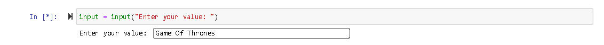
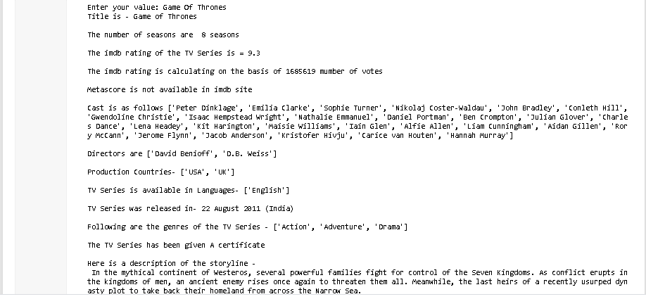
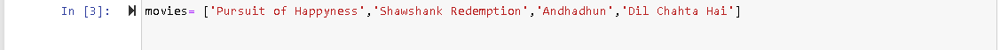
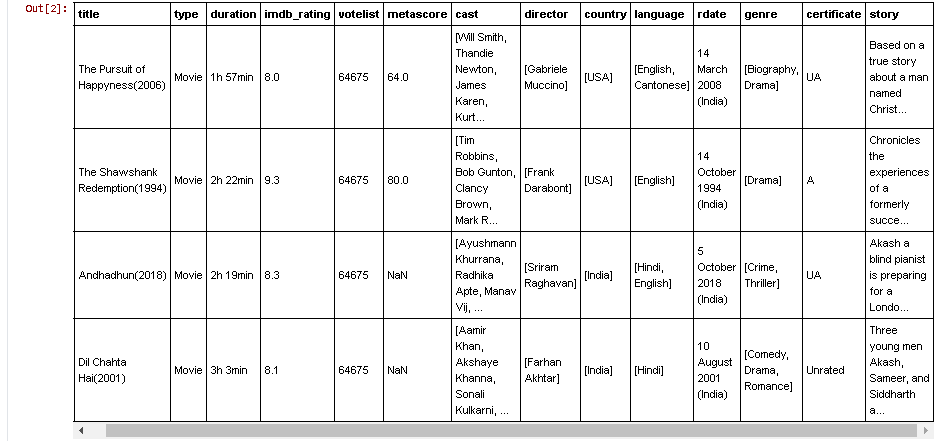

IMDB-Movie-Scraper
============================================

A python script to extract information of movies/TV Series inputted by the user from IMDB site. 

The information to be extracted are:

- **title** : Title of the Movie/TV show
- **type**  : Whether the title entered by user is a Movie or a TV show
- **duration** : Runtime of the Movie or No of seasons in the TV show
- **imdb rating** : IMDB rating of the Movie/TV show
- **votes** : Total number of votes given by users
- **metascore** : Ratings assigned by Meta Critic
- **cast** : Cast of the Movie/TV show
- **director** : Directors of the Movie/TV show
- **country** : Country of production
- **language** : The languages in which the Movie/TV show is available
- **release** : Release date of the Movie/TV show
- **genres** :  The genres that the Movie/TV show falls under
- **certificates** : The ratings certificates given to titles based upon country (G/PG/15+17+/R/18+... etc) 
- **story** : A brief storyline of the Movie/TV Show

## Motivation
I started learning Beautiful Soup as a web scraping tool for one of my ML projects(Netflix Recommender system) few days back. The idea was to gain sufficient knowledge so that I can develop a code to fetch just the IMDB ratings for movies on netflix. So I went through couple of youtube tutorials/blogs, however what I found was that most of them demonstrated usage of Beautiful Soup just to fetch the Top 250 movies from IMDB site. None of them targeted to crawl details for a specific movie. Thus I decided to put the theoretical knowledge I gained into practice and make one such scraper myself.  

## Tools/API used

- Beautiful Soup 
- Jupyter Notebook

## Requirements

The model is built in an Anaconda Environment (Jupyter Notebook) and Python 3.5.0. The libraries to be installed are:
- pandas
- requests
- BeautifulSoup
	

## Installation + Usage

- Clone this repo to your local machine
- Extract the zip file you downloaded
- Install the required libraries as mentioned above
- Run the jupyter notebook titled 'IMDB-Scraper'. The entire code explanation is given in that notebook. You need to enter a movie in the input box and corresponding information will be displayed in the output cell
- Run the jupyter notebook titled 'imdb scraper extended'. This is an extension to the previous notebook as it provide options for user to enter as many movies they want in a list format. The output will not only be printed in the output cell, but can be displayed in a tabular format. The results can further be migrated to a csv file for future analysis work.

**Note** - The code is functional for movie or tv series of any country. There can be instances where information for some of the fields may not be given on the IMDB page. In that case appropriate statements have been issued using Try-Except block 

## Demo

**Run IMDB-Scraper.py**
&nbsp;&nbsp;

&nbsp;&nbsp;

&nbsp;&nbsp;
**Run IMDB-Scraper.py**
&nbsp;&nbsp;

&nbsp;&nbsp;

